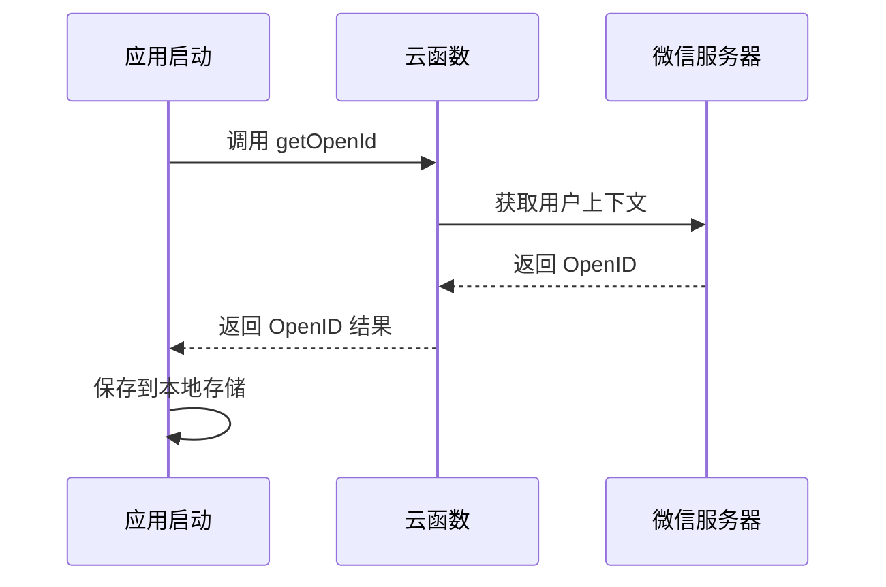
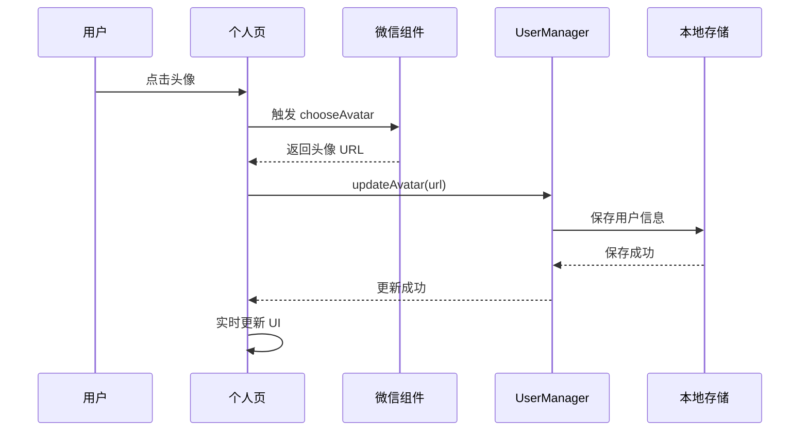
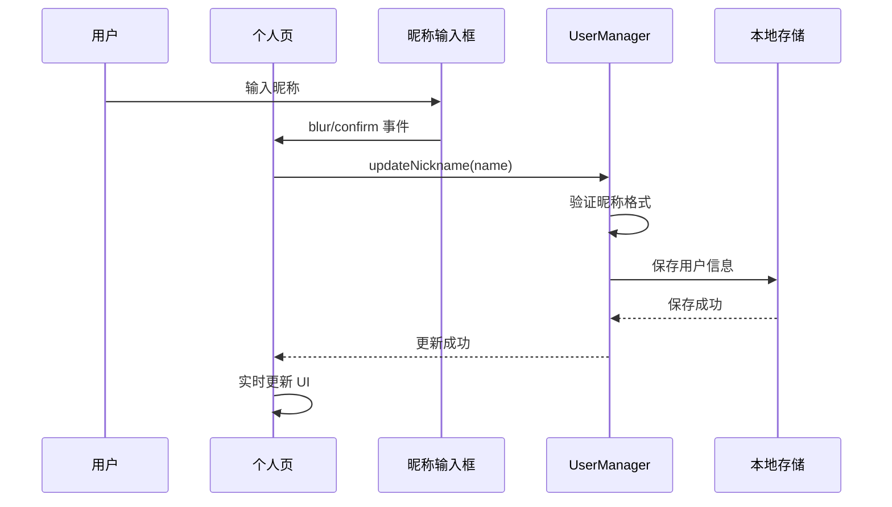

# 微信小程序用户信息管理 - 技术设计

## 1. 架构概览

```
┌─────────────────────────────────────────────────────────────┐
│                        用户界面层                            │
├─────────────────────────────────────────────────────────────┤
│  个人页 (ProfilePage)  │  头像选择组件  │  昵称填写组件     │
├─────────────────────────────────────────────────────────────┤
│                        业务逻辑层                            │
├─────────────────────────────────────────────────────────────┤
│  用户信息管理 (UserManager)  │  OpenID 服务 (OpenIdService) │
├─────────────────────────────────────────────────────────────┤
│                        数据访问层                            │
├─────────────────────────────────────────────────────────────┤
│  本地存储 (LocalStorage)     │  云函数 (CloudFunction)      │
└─────────────────────────────────────────────────────────────┘
```

## 2. 核心组件设计

### 2.1 用户信息数据结构

```typescript
interface UserInfo {
  openid: string;           // 微信 OpenID（必需）
  nickname: string;         // 用户昵称
  avatar: string;           // 头像 URL 或 emoji
  hasAuthorized: boolean;   // 是否已授权
  lastUpdated: number;      // 最后更新时间戳
  source: 'wechat' | 'default'; // 数据来源
}

interface UserStorage {
  USER_INFO: UserInfo;
  USER_OPENID: string;      // 单独存储 OpenID
}
```

### 2.2 OpenID 获取服务

```typescript
class OpenIdService {
  // 获取 OpenID
  async getOpenId(): Promise<string>
  
  // 检查 OpenID 有效性
  validateOpenId(openid: string): boolean
  
  // 生成备用 ID
  generateFallbackId(): string
}
```

### 2.3 用户信息管理器

```typescript
class UserManager {
  // 初始化用户信息
  async initUserInfo(): Promise<UserInfo>
  
  // 更新头像
  async updateAvatar(avatar: string): Promise<boolean>
  
  // 更新昵称
  async updateNickname(nickname: string): Promise<boolean>
  
  // 获取掩码 OpenID（最长16个字符）
  getMaskedOpenId(openid: string): string
  
  // 保存用户信息
  saveUserInfo(userInfo: UserInfo): boolean
  
  // 加载用户信息
  loadUserInfo(): UserInfo | null
}
```

## 3. 微信 API 集成

### 3.1 OpenID 获取流程



### 3.2 头像选择流程



### 3.3 昵称填写流程



## 4. 数据存储设计

### 4.1 本地存储结构

```javascript
// 存储键名
const STORAGE_KEYS = {
  USER_INFO: 'user_info',
  USER_OPENID: 'user_openid'
}

// 存储数据示例
{
  "user_info": {
    "openid": "ox12****cdef",
    "nickname": "小明",
    "avatar": "https://wx.qlogo.cn/...",
    "hasAuthorized": true,
    "lastUpdated": 1704729600000,
    "source": "wechat"
  }
}
```

### 4.2 数据验证规则

```javascript
// 用户信息验证
function validateUserInfo(userInfo) {
  return userInfo && 
         typeof userInfo.openid === 'string' &&
         userInfo.openid.length > 0 &&
         typeof userInfo.nickname === 'string' &&
         typeof userInfo.avatar === 'string' &&
         typeof userInfo.hasAuthorized === 'boolean' &&
         typeof userInfo.lastUpdated === 'number' &&
         ['wechat', 'default'].includes(userInfo.source)
}

// OpenID 验证
function validateOpenId(openid) {
  return typeof openid === 'string' && 
         openid.length > 0 && 
         openid.length <= 50
}

// 昵称验证
function validateNickname(nickname) {
  return nickname && 
         typeof nickname === 'string' &&
         nickname.trim().length > 0 &&
         nickname.length <= 20
}
```

## 5. UI 组件设计

### 5.1 个人页头像区域

```vue
<!-- 头像区域 - 支持 emoji 和真实头像 -->
<view class="avatar-wrapper" @tap="handleAvatarClick">
  <!-- 微信小程序环境 -->
  <!-- #ifdef MP-WEIXIN -->
  <button 
    class="avatar-button" 
    open-type="chooseAvatar" 
    @chooseavatar="onChooseAvatar"
  >
    <!-- URL 头像使用 image 标签 -->
    <image 
      v-if="userInfo.avatar.startsWith('http')" 
      class="avatar-image" 
      :src="userInfo.avatar" 
      mode="aspectFill"
    />
    <!-- emoji 头像使用 text 标签 -->
    <text v-else class="avatar">{{ userInfo.avatar }}</text>
  </button>
  <!-- #endif -->
  
  <!-- H5 环境 -->
  <!-- #ifdef H5 -->
  <image 
    v-if="userInfo.avatar.startsWith('http')" 
    class="avatar-image" 
    :src="userInfo.avatar" 
    mode="aspectFill"
  />
  <text v-else class="avatar">{{ userInfo.avatar }}</text>
  <!-- #endif -->
</view>
```

### 5.2 昵称输入区域

```vue
<!-- 昵称区域 - 支持微信昵称填写 -->
<view class="nickname-wrapper" @tap="handleNicknameClick">
  <!-- #ifdef MP-WEIXIN -->
  <input 
    class="nickname-input" 
    type="nickname" 
    :value="userInfo.nickname"
    placeholder="请输入昵称"
    @blur="onNicknameChange"
    @confirm="onNicknameChange"
  />
  <!-- #endif -->
  
  <!-- #ifdef H5 -->
  <input 
    class="nickname-input" 
    type="text" 
    :value="userInfo.nickname"
    placeholder="请输入昵称"
    @blur="onNicknameChange"
    @confirm="onNicknameChange"
  />
  <!-- #endif -->
</view>
```

### 5.3 OpenID 显示区域

```vue
<!-- OpenID 显示（掩码处理，最长16个字符） -->
<text class="account">ID：{{ maskedOpenId }}</text>
```

### 5.4 用户引导提示框

```vue
<!-- 用户引导提示框 - 首次进入个人页显示 -->
<view v-if="showGuideModal" class="guide-modal" @tap="closeGuideModal">
  <view class="guide-content" @tap.stop>
    <view class="guide-header">
      <text class="guide-title">👋 欢迎来到个人页！</text>
    </view>
    <view class="guide-body">
      <text class="guide-text">点击用户头像可以更新您的头像</text>
      <text class="guide-text">点击昵称可以修改您的昵称</text>
      <text class="guide-hint">让我们开始个性化您的资料吧～</text>
    </view>
    <view class="guide-footer">
      <button class="guide-button" @tap="closeGuideModal">我知道了</button>
    </view>
  </view>
</view>
```

#### 引导提示逻辑

```javascript
// 引导提示状态管理
const showGuideModal = ref(false)

// 检查并显示引导提示
const checkAndShowGuide = () => {
  const hasShownGuide = getProfileGuideShown()
  if (!hasShownGuide) {
    setTimeout(() => {
      showGuideModal.value = true
    }, 800) // 延迟显示，确保页面渲染完成
  }
}

// 关闭引导提示
const closeGuideModal = () => {
  showGuideModal.value = false
  setProfileGuideShown(true) // 记录已显示状态
}
```

## 6. 隐私保护设计

### 6.1 OpenID 掩码规则

```javascript
/**
 * 获取掩码 OpenID
 * @param {string} openid - OpenID
 * @returns {string} 掩码后的 OpenID（最长16个字符）
 */
getMaskedOpenId(openid) {
  if (!openid || openid.length < 8) {
    return '****'
  }
  
  // 限制最长显示16个字符
  let displayOpenId = openid
  if (openid.length > 16) {
    displayOpenId = openid.substring(0, 16)
  }
  
  // 显示前4位和后4位，中间用星号替代
  const start = displayOpenId.substring(0, 4)
  const end = displayOpenId.substring(displayOpenId.length - 4)
  const middle = '*'.repeat(Math.max(4, displayOpenId.length - 8))
  
  return `${start}${middle}${end}`
}
```

### 6.2 UI 优化

- **隐藏授权提示**：不再显示"点击头像和昵称完善信息"的提示文字
- **实时 UI 更新**：头像和昵称选择后立即更新界面，提升用户体验
- **错误处理**：选择失败时显示友好的错误提示

## 7. 错误处理策略

### 7.1 OpenID 获取失败

```javascript
// 降级策略
if (openIdFailed) {
  // 1. 生成本地唯一 ID
  const fallbackId = generateFallbackId()
  
  // 2. 使用默认用户信息
  const defaultUserInfo = {
    openid: fallbackId,
    nickname: '点击设置小朋友昵称',
    avatar: 'https://mmbiz.qpic.cn/mmbiz/icTdbqWNOwNRna42FI242Lcia07jQodd2FJGIYQfG0LAJGFxM4FbnQP6yfMxBgJ0F3YRqJCJ1aPAK2dQagdusBZg/0',
    hasAuthorized: false,
    lastUpdated: Date.now(),
    source: 'default'
  }
}
```

### 7.2 头像选择失败

```javascript
// 错误处理
try {
  const result = await handleChooseAvatar(e)
  if (result.success) {
    // 立即更新 UI
    userInfo.value.avatar = result.data
    // 异步保存
    await userManager.updateAvatar(result.data)
  }
} catch (error) {
  uni.showToast({
    title: '头像选择失败',
    icon: 'none'
  })
}
```

### 7.3 昵称更新失败

```javascript
// 验证和错误处理
const result = await handleNicknameInput(nickname)
if (!result.success) {
  uni.showToast({
    title: result.errMsg || '昵称格式不正确',
    icon: 'none'
  })
  // 恢复原昵称
  setTimeout(() => loadUserInfo(), 100)
}
```

## 8. 性能优化

### 8.1 实时 UI 更新

```javascript
// 头像选择优化
const onChooseAvatar = async (e) => {
  const result = await handleChooseAvatar(e)
  if (result.success) {
    // 1. 立即更新本地 userInfo，确保 UI 实时更新
    userInfo.value.avatar = result.data
    userInfo.value.hasAuthorized = true
    userInfo.value.lastUpdated = Date.now()
    
    // 2. 异步保存到存储
    setTimeout(() => {
      userManager.updateAvatar(result.data)
      loadUserInfo() // 刷新完整信息
    }, 100)
  }
}
```

### 8.2 数据缓存策略

```javascript
// 用户信息缓存
class UserManager {
  constructor() {
    this.userInfo = null
    this.isInitialized = false
  }
  
  async getCurrentUserInfo() {
    // 如果已初始化且有缓存，直接返回
    if (this.isInitialized && this.userInfo) {
      return this.userInfo
    }
    // 否则重新初始化
    return await this.initUserInfo()
  }
}
```

## 9. 兼容性设计

### 9.1 平台差异处理

```javascript
// 条件编译处理平台差异
// #ifdef MP-WEIXIN
// 微信小程序特有逻辑
const openid = await wx.cloud.callFunction({
  name: 'baseFunctions',
  data: { type: 'getOpenId' }
})
// #endif

// #ifdef H5
// H5 环境模拟逻辑
const openid = generateFallbackId()
// #endif
```

### 9.2 API 版本兼容

```javascript
// 检查微信 API 可用性
if (wx.cloud) {
  // 使用云开发 API
} else {
  console.error("请使用 2.2.3 或以上的基础库")
  // 降级处理
}
```

## 10. 测试策略

### 10.1 单元测试

- OpenID 获取和验证
- 用户信息存储和加载
- 掩码 OpenID 生成
- 昵称验证规则

### 10.2 集成测试

- 完整的用户信息初始化流程
- 头像选择和保存流程
- 昵称填写和保存流程
- 跨平台兼容性测试

### 10.3 用户体验测试

- UI 实时更新响应速度
- 错误提示友好性
- 隐私保护效果验证
    Cloud-->>App: 返回用户信息
    App->>App: 保存到本地存储
```

### 3.2 头像昵称填写组件

基于微信官方规范：https://developers.weixin.qq.com/miniprogram/dev/framework/open-ability/userProfile.html

```vue
<!-- 头像选择 -->
<button class="avatar-wrapper" open-type="chooseAvatar" @chooseavatar="onChooseAvatar">
  <image class="avatar" :src="userInfo.avatar"></image>
</button>

<!-- 昵称填写 -->
<input 
  class="nickname-input" 
  type="nickname" 
  placeholder="请输入昵称"
  v-model="userInfo.nickname"
  @blur="onNicknameChange"
/>
```

## 4. 跨平台兼容性

### 4.1 条件编译处理

```vue
<script setup>
// OpenID 获取
const getOpenId = async () => {
  // #ifdef MP-WEIXIN
  try {
    const res = await wx.cloud.callFunction({
      name: 'baseFunctions',
      data: { type: 'getOpenId' }
    })
    return res.result.openid
  } catch (error) {
    console.error('获取 OpenID 失败:', error)
    return generateFallbackId()
  }
  // #endif
  
  // #ifdef H5
  // H5 环境使用本地生成的唯一 ID
  return generateFallbackId()
  // #endif
}

// 头像选择
const onChooseAvatar = (e) => {
  // #ifdef MP-WEIXIN
  const { avatarUrl } = e.detail
  updateUserAvatar(avatarUrl)
  // #endif
  
  // #ifdef H5
  // H5 环境提供默认头像选择
  showAvatarPicker()
  // #endif
}
</script>
```

### 4.2 API 兼容性

| 功能 | 微信小程序 | H5 | 处理方式 |
|------|------------|----|---------| 
| OpenID 获取 | wx.cloud.callFunction | 本地生成 ID | 条件编译 |
| 头像选择 | open-type="chooseAvatar" | 文件选择器 | 条件编译 |
| 昵称填写 | type="nickname" | type="text" | 条件编译 |

## 5. 数据存储设计

### 5.1 本地存储结构

```javascript
// 存储键名
const STORAGE_KEYS = {
  USER_INFO: 'USER_INFO',
  USER_OPENID: 'USER_OPENID',
  PROFILE_GUIDE_SHOWN: 'PROFILE_GUIDE_SHOWN'  // 个人页引导提示状态
}

// 存储数据格式
const userInfoStorage = {
  openid: 'ox1234567890abcdef',
  nickname: '小明',
  avatar: 'https://wx.qlogo.cn/...',
  hasAuthorized: true,
  lastUpdated: 1704672000000,
  source: 'wechat'
}

// 引导提示状态存储
const guideStorage = {
  profile_guide_shown: true  // 个人页引导提示是否已显示
}
```

### 5.2 数据验证和迁移

```javascript
// 数据验证
const validateUserInfo = (userInfo) => {
  return userInfo && 
         typeof userInfo.openid === 'string' &&
         userInfo.openid.length > 0 &&
         typeof userInfo.nickname === 'string' &&
         typeof userInfo.avatar === 'string'
}

// 数据迁移（兼容旧版本）
const migrateUserData = (oldData) => {
  if (oldData && !oldData.openid) {
    return {
      ...oldData,
      openid: generateFallbackId(),
      hasAuthorized: false,
      lastUpdated: Date.now(),
      source: 'default'
    }
  }
  return oldData
}
```

## 6. 隐私保护

### 6.1 OpenID 掩码规则

```javascript
// OpenID 掩码显示
const maskOpenId = (openid) => {
  if (!openid || openid.length < 8) {
    return '****'
  }
  
  // 显示前4位和后4位，中间用星号替代
  const start = openid.substring(0, 4)
  const end = openid.substring(openid.length - 4)
  const middle = '*'.repeat(Math.max(4, openid.length - 8))
  
  return `${start}${middle}${end}`
}

// 示例：ox1234567890abcdef -> ox12****cdef
```

### 6.2 敏感信息处理

- OpenID 仅在必要时获取和存储
- 头像 URL 使用微信官方 CDN，不缓存到本地
- 昵称支持用户自定义，不强制使用微信昵称
- 所有用户数据仅存储在本地，不上传到第三方服务器

## 7. 错误处理

### 7.1 错误类型和处理策略

```javascript
const ERROR_TYPES = {
  OPENID_FETCH_FAILED: 'openid_fetch_failed',
  AVATAR_CHOOSE_FAILED: 'avatar_choose_failed',
  NICKNAME_UPDATE_FAILED: 'nickname_update_failed',
  STORAGE_FAILED: 'storage_failed'
}

const handleError = (errorType, error) => {
  switch (errorType) {
    case ERROR_TYPES.OPENID_FETCH_FAILED:
      // 使用备用 ID，不影响用户使用
      console.warn('OpenID 获取失败，使用备用方案')
      return generateFallbackId()
      
    case ERROR_TYPES.AVATAR_CHOOSE_FAILED:
      // 保持当前头像，提示用户重试
      uni.showToast({
        title: '头像选择失败，请重试',
        icon: 'none'
      })
      break
      
    case ERROR_TYPES.STORAGE_FAILED:
      // 使用内存存储，提示用户
      console.error('本地存储失败:', error)
      uni.showToast({
        title: '数据保存失败',
        icon: 'none'
      })
      break
  }
}
```

## 8. 性能优化

### 8.1 初始化优化

- OpenID 获取采用异步方式，不阻塞应用启动
- 用户信息加载使用缓存优先策略
- 头像图片使用懒加载和压缩

### 8.2 存储优化

- 用户信息变更时才更新存储，避免频繁写入
- 使用防抖机制处理昵称输入
- 用户信息过期检查间隔设置为24小时，减少不必要的刷新
- 定期清理过期的用户数据

## 9. 测试策略

### 9.1 单元测试

- OpenID 获取和验证逻辑
- 用户信息存储和加载
- 掩码算法正确性
- 错误处理机制

### 9.2 集成测试

- 微信小程序环境下的完整流程
- H5 环境下的兼容性
- 数据迁移和版本兼容性
- 跨页面的用户信息同步

### 9.3 用户体验测试

- 头像选择流程的易用性
- 昵称填写的响应性
- 错误提示的友好性
- 不同设备和网络环境下的表现
- **用户引导提示的有效性**：
  - 首次进入个人页时引导提示的显示时机
  - 引导提示内容的清晰度和指导性
  - 引导提示关闭后的状态保存
  - 引导提示的视觉效果和动画流畅性